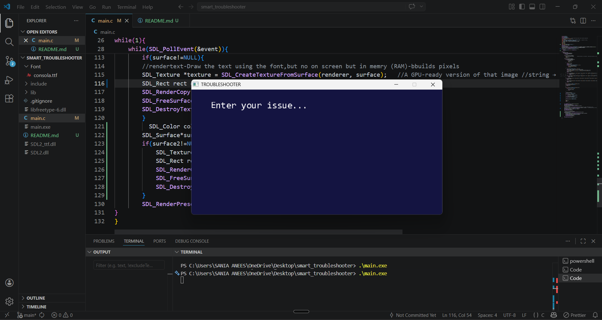
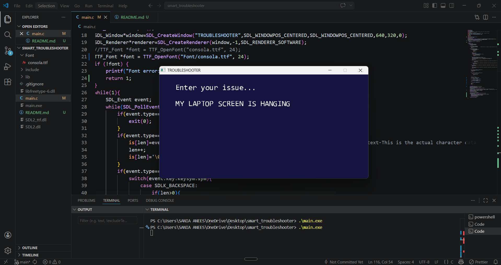
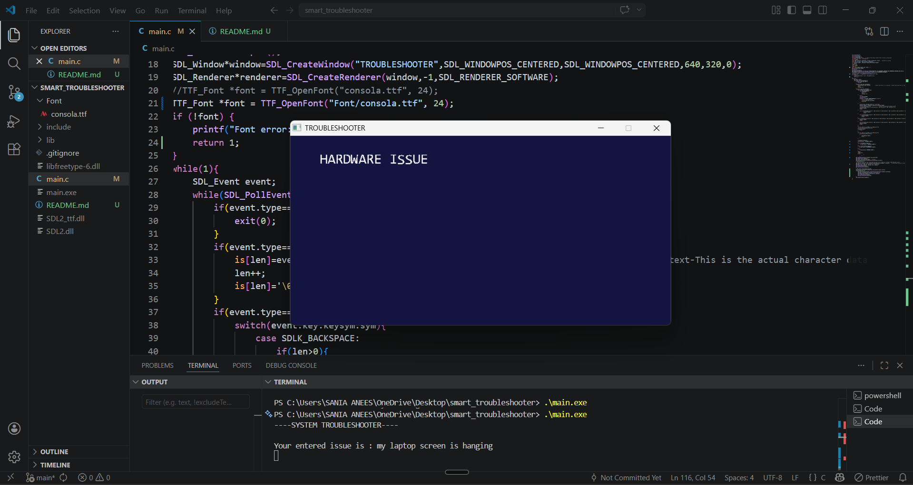

# 📌 Smart Troubleshooter

A lightweight interactive system troubleshooter built in **C using SDL2**, designed to simulate how basic diagnostic systems classify user-reported issues.

---

## 🚀 Overview

This project provides a simple UI where users can type system-related issues (e.g., *“connection lost”*, *“system lag”*), and the application classifies them into categories like:

- Network Issues  
- Hardware Issues  
- Performance Issues  

The goal was to explore **event-driven programming**, **low-level input handling**, and **basic rule-based classification** in a graphical environment.

---

## 🧠 Key Features

- Real-time text input using SDL event system  
- Keyword-based classification engine  
- Interactive UI rendering with SDL2 and SDL_ttf  
- Immediate feedback loop *(input → detection → output)*  

---

## 🛠️ Tech Stack

- **Language:** C  
- **Libraries:** SDL2, SDL_ttf  

---

## ⚙️ How It Works

1. User types an issue into the UI  
2. Input is captured via SDL text events  
3. String is normalized *(converted to lowercase)*  
4. Keywords are matched against predefined categories:
   - **Network** → wifi, internet, connection  
   - **Hardware** → mouse, keyboard, USB  
   - **Performance** → lag, freeze, slow  
5. The detected issue type is displayed on screen  

---

## 🧩 Project Structure

```
smart_troubleshooter/
│
├── main.c
├── Font/
│   └── consola.ttf
├── include/
├── lib/
├── SDL2.dll
├── SDL2_ttf.dll
└── README.md
```

---

## ▶️ Build & Run

### Compile

```
gcc -o main main.c -I./include -L./lib -lmingw32 -lSDL2main -lSDL2 -lSDL2_ttf
```

### Run

```
./main.exe
```

---

## 📸 Demo


### Input Interface


### Typing Issue


### Output Result


---

## 🔍 Limitations

- Rule-based detection *(not context-aware)*  
- Limited vocabulary  
- No suggestion system yet  

---

## 🔮 Future Improvements

- Smarter detection logic *(NLP-based classification)*  
- Add troubleshooting suggestions  
- Better UI/UX *(layout, colors, input box)*  
- Logging + history of issues  

---

## 🎯 Why This Project?

Instead of building a console-based program, this project focuses on:

- Understanding low-level UI rendering  
- Handling real-time input systems  
- Designing a basic decision-making engine  

---

## 🧑‍💻 Author

**Sania**